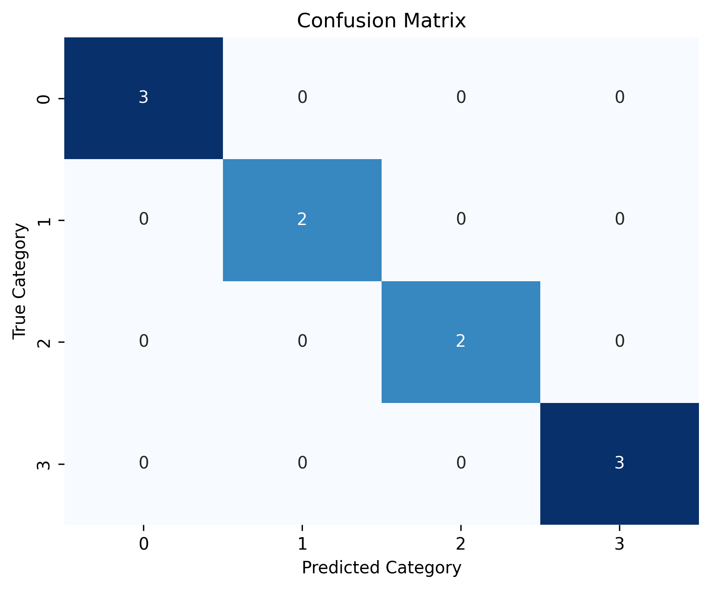
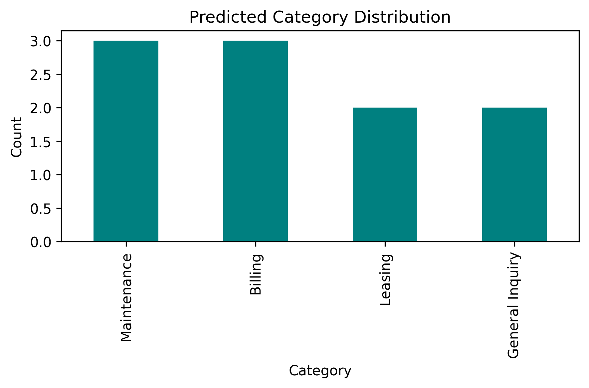

# 🧠 AI Customer Message Classifier

This project demonstrates an applied **AI integration workflow** that automatically classifies
and routes customer or tenant messages into operational categories such as **Maintenance**, **Billing**, **Leasing**, and **General Inquiry**.

Using **Python**, **DuckDB**, and the **OpenAI API**, it bridges natural language understanding with business operations, showing how AI-powered automation can streamline communication workflows and reduce manual triage.

---

## 📊 Key Objectives

- Build a reproducible, lightweight LLM-based classifier for message categorization  
- Apply prompt-based classification with OpenAI GPT-4o mini  
- Evaluate precision, recall, and F1-score across categories  
- Store all classified messages in a DuckDB database for downstream analytics  
- Generate visual performance reports suitable for integration with BI tools  

---

## ⚙️ Tech Stack

| Component | Technology |
|------------|-------------|
| Language | Python 3.11 |
| Data Storage | DuckDB |
| AI Integration | OpenAI API (GPT-4o mini) |
| Libraries | pandas, numpy, scikit-learn, seaborn, matplotlib |
| Environment | Conda + JupyterLab |
| Version Control | Git + GitHub |

---

## 🧩 Repository Structure
```text
ai-customer-message-classifier/
├── data/
│ ├── synthetic_messages.csv
│ └── classified_messages.duckdb
├── figures/
│ ├── confusion_matrix.png
│ ├── predicted_distribution.png
│ └── classification_report.csv
├── notebooks/
│ └── ai_customer_message_classifier.ipynb
├── src/
│ └── classify.py (optional future CLI utility)
├── requirements.txt
├── .gitignore
└── README.md


---

## 🧪 Example Workflow

1. **Data Generation** – Synthetic messages are created and labeled.  
2. **Classification** – Each message is processed through an LLM API prompt.  
3. **Evaluation** – Accuracy and confusion matrix are calculated via `scikit-learn`.  
4. **Storage** – Results persist in a DuckDB database.  
5. **Visualization** – Metrics and plots are saved to `/figures`.

---

## 📈 Visualizations

| Visualization | Description |
|----------------|--------------|
|  | Evaluates model accuracy across true vs. predicted categories |
|  | Shows message volume by predicted category |
| [Classification Report (CSV)](figures/classification_report.csv) | Precision, recall, and F1-score by category |

---

## 🧠 Summary and Next Steps

**Key outcomes**
- Generated and classified customer messages using an LLM integration pipeline  
- Evaluated classification performance visually and numerically  
- Saved all metrics and results for reproducibility and downstream analysis  

**Next steps**
1. Expand the dataset with diverse examples  
2. Integrate classifier with a **Streamlit** or **FastAPI** interface  
3. Add confidence scoring and feedback-based retraining  
4. Automate daily classification with GitHub Actions  

---

## 💻 Setup Instructions

```bash
# Create environment
conda create -n message-classifier python=3.11 -y
conda activate message-classifier

# Install dependencies
pip install -r requirements.txt

# Run JupyterLab
jupyter lab

Environment Variables
Create a .env file in the project root:
OPENAI_API_KEY=your_api_key_here

🧾 License

This project is released under the MIT License.

👤 Author
Michael S. Mohle
